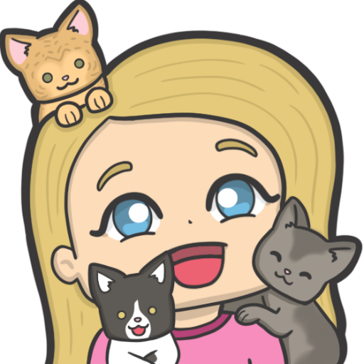

# BasecaWheel

A browser-based **spinning wheel of chance** — but a mischievous one. Add
entrants, give them weights, and spin. The wheel doesn't just pick a winner: it
can slow down, reverse, boost, shuffle entrants mid-spin, or occasionally
explode and declare that *nobody* wins. It's a single, self-contained web app
with no build step and no runtime dependencies.



---

## Features

### Wheels (slots)
- Maintain **multiple independent wheels**, each with its own entrants,
  settings, title, and winner history.
- Reorder wheels by **drag-and-drop** (with auto-scroll when the list is long).
- **Clone** a wheel, **clear** all wheels, or add a new one inline.
- **Save** all wheels to a timestamped JSON file and **Load** them back —
  a full backup/restore of everything.
- A resizable **divider** between the Wheels and Entrants lists lets you give
  each list more or less room; the split is remembered across reloads.

### Entrants
- Add entrants by typing in the pinned input and pressing **Enter** — new
  entrants land at the top of the list.
- Optional **weighting**: type `Name, 5` to give an entrant weight 5. Heavier
  entrants occupy a proportionally larger slice.
- Per-entrant **+/− weight** controls, plus bulk actions: shuffle order,
  ±1 to all, set all to 1, and clear the list.

### Spin mechanics & "mischief"
During a spin, random events can fire based on per-wheel probabilities
(configured in the settings menu):

| Event | What it does |
|-------|--------------|
| ⏱️ Spin Time | Scales how long spins take |
| 💥 Explode | Wheel "breaks" — nobody wins, with a screen-shaking debris blast |
| 🔄 Reverse Spin | Wheel reverses direction mid-spin |
| 🐢 Slowdown | Wheel briefly drags |
| 🐇 Boost | Wheel speeds back up |
| 🔀 Late Shuffle | Entrants get swapped near the end |

The center reacts with an animated emoji/image that changes per state
(excited, nervous, shocked, relieved, …), a flame effect that flickers faster
the quicker the wheel spins, a clicking pointer, and a confetti-filled heart
when a winner lands.

### Feature toggles
Per-wheel options in the settings menu:
- **Keep Winners Log** — persist a dated winner history (`YYYY-MM-DD`) with the
  wheel; off by default (session-only).
- **Hide Percentages** — show only names on the slices.
- **Idle Ticks** — play the pointer tick during the slow idle rotation.
- **Auto Increment Losers** — every non-winner gains +1 weight after a spin.
- **Auto Remove Winner** / **Auto Decrement Winner** / **Set Winner to 1** —
  mutually-exclusive post-spin actions on the winner.

### Sounds & images
- Eight built-in sound effects (background loop, tick, boost, explode, fanfare,
  reverse, shuffle, slowdown). Each is overridable per-wheel with a custom
  relative path or external URL (cross-origin URLs fall back to an
  `<audio>` element automatically).
- The wheel's center artwork is fully customizable per emotional state. Pick
  from a built-in **image gallery** (browses everything in `images/`) or paste
  your own paths/URLs. Multiple images per state are chosen at random.

### History, mute, raw data
- A **winner history** panel (📜) lists results for the active wheel.
- A **mute** toggle for all audio.
- An **Edit Raw Data** view exposes the full JSON state for direct editing.

### Quality-of-life
- Smooth sidebar collapse/expand with the wheel, center image, pointer, and
  title all tracking the animation in lockstep.
- Consistent thin scrollbars across browsers; Lucide SVG icons (instead of
  emoji) so the UI looks identical on every platform.
- **Idle sleep**: after 5 minutes of no interaction, all animations pause to
  save battery/CPU, resuming instantly on any input.

---

## Running it

The app is plain static files. The included Python server sets no-cache headers
(handy during development) and regenerates the image gallery manifest on
startup:

```bash
python3 serve.py
```

This serves at `http://localhost:8080/BasecaWheel.html` and opens it in your
browser. Any static file server works too — or just open `BasecaWheel.html`
directly (`file://`), though the image gallery needs `images/manifest.json`
present (which `serve.py` regenerates automatically; drop new images into
`images/` and restart).

No installation, no build, no `node_modules`.

---

## Infrastructure

### Single-page, no build system
Everything is hand-written HTML/CSS/JS. There is no bundler, transpiler, or
package manager. The code is split across several plain `<script>` files that
share a global scope (no ES modules), loaded in a **strict order** because later
files depend on globals and functions declared earlier:

```
constants.js → state.js → storage.js → emoji.js → audio.js
            → wheel.js → spin.js → ui.js → boot.js
```

Each file begins with a header comment documenting what it reads, mutates, and
calls, plus any cross-file pitfalls.

| File | Responsibility |
|------|----------------|
| `constants.js` | Read-only constants: storage keys, defaults, colors, labels, sound/image maps |
| `state.js` | DOM element references and all shared mutable state |
| `storage.js` | localStorage read/write helpers + `activateSlot()` |
| `emoji.js` | Center image / emoji state system |
| `audio.js` | Web Audio playback, preloading, cross-origin fallback |
| `wheel.js` | Canvas drawing, wheel math, layout, idle rotation, flame speed |
| `spin.js` | Spin loop, mischief events, confetti, explosion, nobody-wins |
| `ui.js` | Sidebar/list rendering, settings, modals, controls, drag, history |
| `boot.js` | Startup: load slots, size the canvas, pre-cache images, observers |

### Persistence
State lives in **localStorage** (no backend):

- `basca_active_slot` — id of the currently selected wheel
- `basca_wheel_list` — ordered list of `{ id, title }`
- `basca_slot_<id>` — per-wheel data (title, entrants, settings, history)
- `basca_divider_h` — saved Wheels/Entrants divider height

All writes go through a `safeSetItem()` wrapper so a quota error (e.g. Safari
Private Browsing) degrades gracefully instead of throwing.

### Rendering
- The wheel is drawn on a `<canvas>` (slices, labels, weights).
- The center image, pointer, title, and winner/"nobody" popup are HTML/CSS
  layered over the canvas, kept in sync via JS measurement.
- Animations use `requestAnimationFrame` (idle rotation, spin physics, flame
  speed) and CSS keyframes (flames, emoji reactions, glow, confetti).

### Audio
Web Audio API with buffers decoded up-front and the context resumed on the
first user gesture (to satisfy autoplay policies). Cross-origin sound URLs that
can't be fetched fall back to an `<HTMLAudioElement>`.

### Assets
- `images/` — center artwork (`*.png`) plus a generated `manifest.json` the
  gallery reads.
- `sounds/` — the eight default `*.wav` effects.
- `icons/` — Lucide SVG icons (recolored white) used throughout the UI.

---

## Project layout

```
BasecaWheel.html      markup + <link>/<script> tags only
serve.py              dev server (no-cache headers, manifest regeneration)
css/
  basca.css           all styles
js/
  constants.js  state.js  storage.js  emoji.js  audio.js
  wheel.js  spin.js  ui.js  boot.js
icons/                Lucide SVG icons
images/               center artwork + manifest.json
sounds/               default sound effects
```